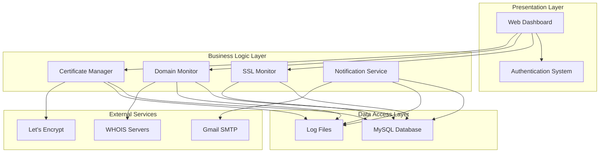

# Design Document: SSL & Domain Expiry Tracking Application

## Overview

The SSL & Domain Expiry Tracking Application is a PHP-based web application that monitors SSL certificate and domain expiration dates, providing automated email notifications to prevent service disruptions. The system uses a modular architecture with separate components for SSL monitoring, domain monitoring, certificate management, and notifications.

The application leverages PHP 8.x with OpenSSL extensions for SSL certificate validation, WHOIS lookups for domain expiration tracking, and Let's Encrypt integration via Certbot for automated certificate management. All data is stored in a MySQL database with a responsive web interface for administration.

## Architecture

The system follows a layered architecture pattern with clear separation of concerns:



### Core Components

1. **Web Dashboard**: PHP-based responsive interface with session authentication
2. **SSL Monitor**: OpenSSL-based certificate validation and expiration checking
3. **Domain Monitor**: WHOIS-based domain expiration date retrieval
4. **Certificate Manager**: Let's Encrypt integration for certificate generation and renewal
5. **Notification Service**: Gmail SMTP-based email alert system
6. **Cron Scheduler**: Linux cron jobs for automated monitoring

## Components and Interfaces

### SSL Monitor Component

**Purpose**: Monitor SSL certificate expiration dates using PHP OpenSSL functions

**Key Methods**:
- `checkCertificate(string $hostname, int $port = 443): CertificateInfo`
- `parseCertificateData(resource $certificate): array`
- `calculateDaysUntilExpiry(int $expiryTimestamp): int`

**Implementation Approach**:
Uses `stream_socket_client()` with SSL context to retrieve certificates and `openssl_x509_parse()` to extract expiration data. Handles connection timeouts and SSL handshake failures gracefully.

### Domain Monitor Component

**Purpose**: Check domain expiration dates via WHOIS lookups

**Key Methods**:
- `checkDomain(string $domain): DomainInfo`
- `performWhoisLookup(string $domain): string`
- `parseExpirationDate(string $whoisData): DateTime`

**Implementation Approach**:
Uses socket connections to WHOIS servers or external WHOIS libraries. Parses various WHOIS response formats to extract expiration dates, handling different registrar formats and internationalized domains.

### Certificate Manager Component

**Purpose**: Generate and manage Let's Encrypt SSL certificates

**Key Methods**:
- `generateCertificate(string $domain, bool $wildcard = false): CertificateResult`
- `renewCertificate(string $domain): RenewalResult`
- `validateDnsChallenge(string $domain, string $token): bool`

**Implementation Approach**:
Integrates with Certbot command-line tool via PHP `exec()` functions. Manages DNS-01 challenges for wildcard certificates and HTTP-01 challenges for single domains. Stores certificate paths securely in database.

### Notification Service Component

**Purpose**: Send email alerts via Gmail SMTP

**Key Methods**:
- `sendExpirationAlert(array $items): bool`
- `formatNotificationEmail(array $items): string`
- `configureSMTP(): void`

**Implementation Approach**:
Uses PHPMailer library with Gmail SMTP configuration. Implements retry logic for failed deliveries and prevents duplicate notifications within 24-hour windows.

## Data Models

### Database Schema

```sql
-- Tracking items table
CREATE TABLE tracking_items (
    id INT PRIMARY KEY AUTO_INCREMENT,
    name VARCHAR(255) NOT NULL,
    type ENUM('domain', 'ssl') NOT NULL,
    hostname VARCHAR(255) NOT NULL,
    port INT DEFAULT 443,
    registrar VARCHAR(255),
    admin_emails TEXT,
    expiry_date DATETIME,
    last_checked DATETIME,
    status ENUM('active', 'warning', 'expired', 'error') DEFAULT 'active',
    error_message TEXT,
    created_at TIMESTAMP DEFAULT CURRENT_TIMESTAMP,
    updated_at TIMESTAMP DEFAULT CURRENT_TIMESTAMP ON UPDATE CURRENT_TIMESTAMP,
    INDEX idx_expiry_date (expiry_date),
    INDEX idx_type_status (type, status)
);

-- SSL certificates table
CREATE TABLE ssl_certificates (
    id INT PRIMARY KEY AUTO_INCREMENT,
    tracking_item_id INT NOT NULL,
    issuer VARCHAR(255),
    subject VARCHAR(255),
    is_wildcard BOOLEAN DEFAULT FALSE,
    certificate_path VARCHAR(500),
    private_key_path VARCHAR(500),
    chain_path VARCHAR(500),
    auto_renew BOOLEAN DEFAULT TRUE,
    FOREIGN KEY (tracking_item_id) REFERENCES tracking_items(id) ON DELETE CASCADE
);

-- Notification history table
CREATE TABLE notification_history (
    id INT PRIMARY KEY AUTO_INCREMENT,
    tracking_item_id INT NOT NULL,
    notification_type ENUM('ssl_expiry', 'domain_expiry') NOT NULL,
    days_remaining INT NOT NULL,
    sent_at TIMESTAMP DEFAULT CURRENT_TIMESTAMP,
    email_status ENUM('sent', 'failed', 'retry') DEFAULT 'sent',
    error_message TEXT,
    FOREIGN KEY (tracking_item_id) REFERENCES tracking_items(id) ON DELETE CASCADE,
    INDEX idx_sent_at (sent_at)
);

-- Configuration table
CREATE TABLE app_config (
    config_key VARCHAR(100) PRIMARY KEY,
    config_value TEXT NOT NULL,
    updated_at TIMESTAMP DEFAULT CURRENT_TIMESTAMP ON UPDATE CURRENT_TIMESTAMP
);

-- User sessions table
CREATE TABLE user_sessions (
    session_id VARCHAR(128) PRIMARY KEY,
    user_data TEXT,
    last_activity TIMESTAMP DEFAULT CURRENT_TIMESTAMP,
    expires_at TIMESTAMP NOT NULL,
    INDEX idx_expires_at (expires_at)
);
```

### PHP Data Models

```php
class TrackingItem {
    public int $id;
    public string $name;
    public string $type; // 'domain' or 'ssl'
    public string $hostname;
    public int $port;
    public ?string $registrar;
    public ?array $adminEmails;
    public ?DateTime $expiryDate;
    public ?DateTime $lastChecked;
    public string $status;
    public ?string $errorMessage;
}

class CertificateInfo {
    public string $issuer;
    public string $subject;
    public DateTime $validFrom;
    public DateTime $validTo;
    public bool $isWildcard;
    public array $subjectAltNames;
}

class DomainInfo {
    public string $domain;
    public ?string $registrar;
    public ?DateTime $expiryDate;
    public ?DateTime $lastUpdated;
    public string $status;
}
```

## Correctness Properties

*A property is a characteristic or behavior that should hold true across all valid executions of a system—essentially, a formal statement about what the system should do. Properties serve as the bridge between human-readable specifications and machine-verifiable correctness guarantees.*

### Property 1: Data Persistence Integrity
*For any* valid tracking item (domain or SSL certificate), when added to the system, it should be stored in the database with all provided attributes and remain retrievable with identical data.
**Validates: Requirements 1.1, 1.3, 6.3**

### Property 2: WHOIS Integration Consistency  
*For any* domain added to the system, the WHOIS lookup should be triggered and the extracted expiration date should be stored in the database.
**Validates: Requirements 1.2, 3.1, 3.2**

### Property 3: SSL Certificate Parsing Accuracy
*For any* valid SSL certificate retrieved from an endpoint, the Certificate_Parser should correctly extract issuer, expiration date, and wildcard status.
**Validates: Requirements 2.1, 2.2**

### Property 4: Input Validation Rejection
*For any* invalid domain name or SSL endpoint, the system should reject the input and prevent database storage.
**Validates: Requirements 1.5, 9.3**

### Property 5: Item Removal Completeness
*For any* tracking item that exists in the system, when removed, it should be completely deleted from the database and no longer appear in any queries.
**Validates: Requirements 1.4**

### Property 6: Expiration-Based Notification Triggering
*For any* tracking item with expiration date within the threshold (7 days for SSL, 30 days for domains), a notification should be sent via Gmail SMTP.
**Validates: Requirements 4.1, 4.2**

### Property 7: Notification Content Completeness
*For any* notification email generated, it should contain domain name, expiry date, days remaining, and the subject line format "⚠️ Expiry Alert".
**Validates: Requirements 4.4**

### Property 8: Duplicate Notification Prevention
*For any* tracking item, if a notification has been sent within 24 hours, no additional notifications should be sent for the same expiration event.
**Validates: Requirements 4.5**

### Property 9: Status Indicator Accuracy
*For any* tracking item displayed on the dashboard, the status indicator color should correctly reflect the expiration state (green for safe, yellow for warning, red for expired).
**Validates: Requirements 5.3, 5.4, 5.5**

### Property 10: Dashboard Summary Accuracy
*For any* dashboard view, the summary counts should accurately reflect the total domains, domains expiring soon, and SSL certificates expiring soon.
**Validates: Requirements 5.2**

### Property 11: Certificate Generation Integration
*For any* valid domain requested for SSL generation, the Certbot_Manager should execute the appropriate Let's Encrypt commands and store the resulting certificate paths.
**Validates: Requirements 6.1, 6.2**

### Property 12: Certificate Renewal Automation
*For any* certificate approaching expiration (within renewal threshold), the system should automatically trigger renewal via Certbot.
**Validates: Requirements 6.4**

### Property 13: Comprehensive Error Logging
*For any* system error (network timeouts, database failures, email failures), the system should log the error with timestamp, error type, and relevant context.
**Validates: Requirements 2.3, 3.3, 8.1, 8.2, 8.3, 8.4**

### Property 14: Monitoring Continuation After Errors
*For any* monitoring cycle that encounters errors, the system should log the errors and continue processing the remaining tracking items.
**Validates: Requirements 7.4**

### Property 15: Monitoring Activity Logging
*For any* monitoring cycle execution, the system should generate logs documenting emails sent, failures encountered, and scan results.
**Validates: Requirements 7.3**

### Property 16: Secure Connection Usage
*For any* external service call (WHOIS, SMTP, Let's Encrypt), the system should use secure connections (HTTPS/TLS) when available.
**Validates: Requirements 9.4**

### Property 17: Session Management Security
*For any* user session, it should automatically timeout after the configured inactive period and require re-authentication.
**Validates: Requirements 9.5**

### Property 18: File System Organization
*For any* file or log created by the system, it should be placed in the correct directory structure with appropriate permissions.
**Validates: Requirements 10.4**

## Error Handling

The system implements comprehensive error handling across all components:

### Network Error Handling
- **Connection Timeouts**: 30-second timeout for SSL certificate retrieval and WHOIS lookups
- **Retry Logic**: Up to 3 retry attempts for network operations with exponential backoff
- **Graceful Degradation**: Mark items as unreachable rather than failing entire monitoring cycles

### Database Error Handling
- **Connection Failures**: Automatic reconnection attempts with connection pooling
- **Query Failures**: Transaction rollback and error logging with context
- **Data Integrity**: Foreign key constraints and data validation at database level

### Email Delivery Error Handling
- **SMTP Failures**: Retry logic with exponential backoff (1, 5, 15 minutes)
- **Authentication Errors**: Detailed logging and configuration validation
- **Rate Limiting**: Respect Gmail SMTP rate limits with queuing

### Certificate Management Error Handling
- **Certbot Failures**: Parse command output for specific error types
- **DNS Challenge Failures**: Detailed logging of DNS validation issues
- **File Permission Errors**: Proper error handling for certificate file operations

## Testing Strategy

The application uses a dual testing approach combining unit tests and property-based tests for comprehensive coverage:

### Unit Testing Approach
Unit tests focus on specific examples, edge cases, and integration points:
- **Authentication flows**: Login, logout, session management
- **Database operations**: CRUD operations, connection handling
- **Email formatting**: Specific notification templates and content
- **Configuration validation**: SMTP settings, database connections
- **Error conditions**: Invalid inputs, network failures, permission errors

### Property-Based Testing Approach
Property-based tests verify universal properties across randomized inputs using PHPUnit with property testing extensions:
- **Minimum 100 iterations** per property test to ensure comprehensive coverage
- **Random data generation** for domains, SSL endpoints, certificates, and user inputs
- **Universal property validation** across all possible valid inputs
- **Edge case discovery** through randomized testing

### Property Test Configuration
Each property-based test must:
- Run minimum 100 iterations due to randomization
- Reference its corresponding design document property
- Use tag format: **Feature: ssl-domain-expiry-tracker, Property {number}: {property_text}**
- Generate realistic test data (valid domains, certificate formats, etc.)

### Testing Libraries and Tools
- **PHPUnit**: Primary testing framework for both unit and property tests
- **Faker**: Generate realistic test data for domains, emails, dates
- **Mockery**: Mock external services (WHOIS, SMTP, Certbot)
- **Database Testing**: In-memory SQLite for fast test execution
- **Property Testing Extension**: Custom generators for SSL certificates and WHOIS responses

### Test Data Management
- **Certificate Fixtures**: Pre-generated test certificates with known expiration dates
- **WHOIS Response Fixtures**: Sample WHOIS responses from various registrars
- **Email Templates**: Expected notification formats for validation
- **Database Migrations**: Test-specific database schema for isolation

The testing strategy ensures both specific functionality works correctly (unit tests) and universal properties hold across all inputs (property tests), providing confidence in system correctness and reliability.